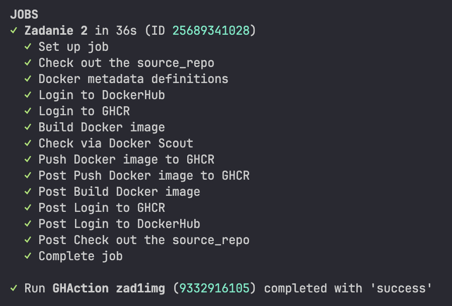

# PAwChO - Rozwiązanie zadania 2

Prosta aplikacja webowa w JavaScript, wzięta z rozwiązania zadania 1.

[Pipeline](.github/workflows/gha_example.yml) definiuje:

- budowanie obrazu multiarch
- testowanie bezpieczeństwa obrazu
- przesłanie na Github, gdy obraz nie ma wysokich lub krytycznych podatności

### Uwagi:
- Moje rozwiązanie zadania 1, ma jedną krytyczną podatność. Więc obraz nie pojawia się w GHCR.
Aby pokazać poprawność działania łańcuchu CI, treść Dockerfile powinna być następująca:
```Dockerfile
FROM alpine:3.17

RUN apk add --no-cache busybox-extras

EXPOSE 3000
```
Jest to prosty obraz bez żadnych podatności

### Wynik działania pipeline dla obrazu bez podatności:

